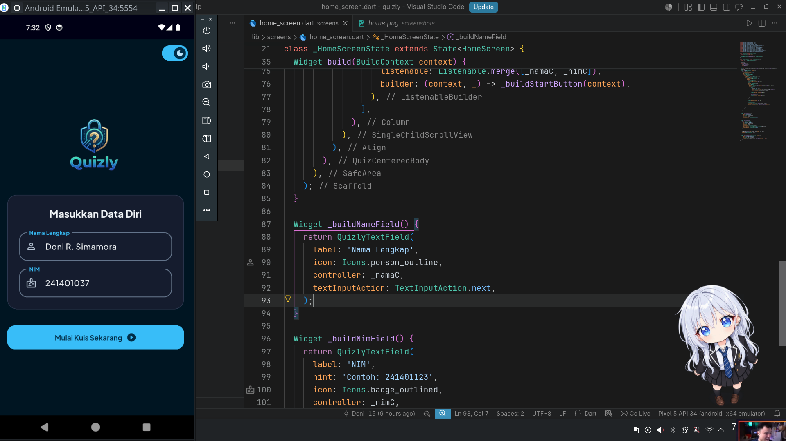
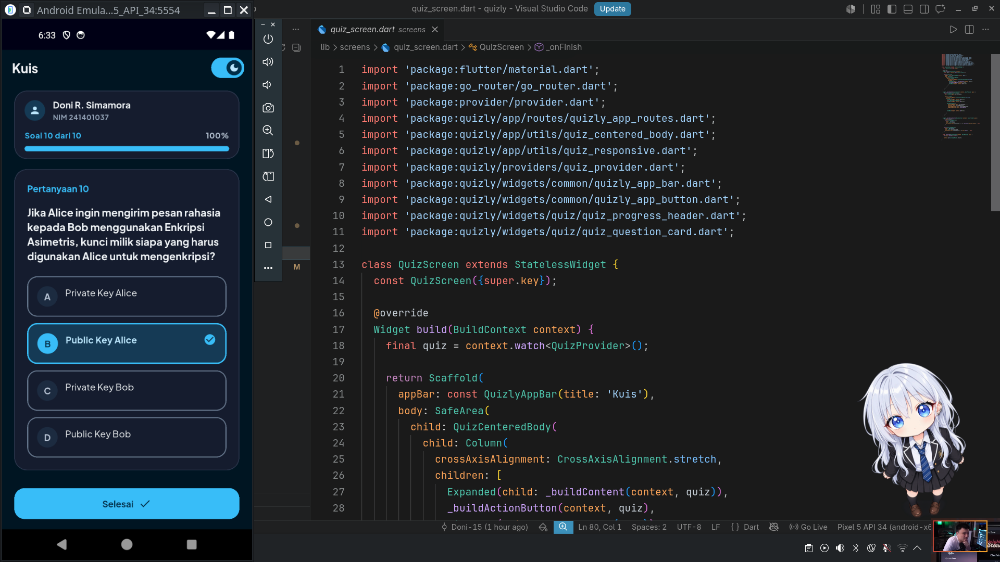
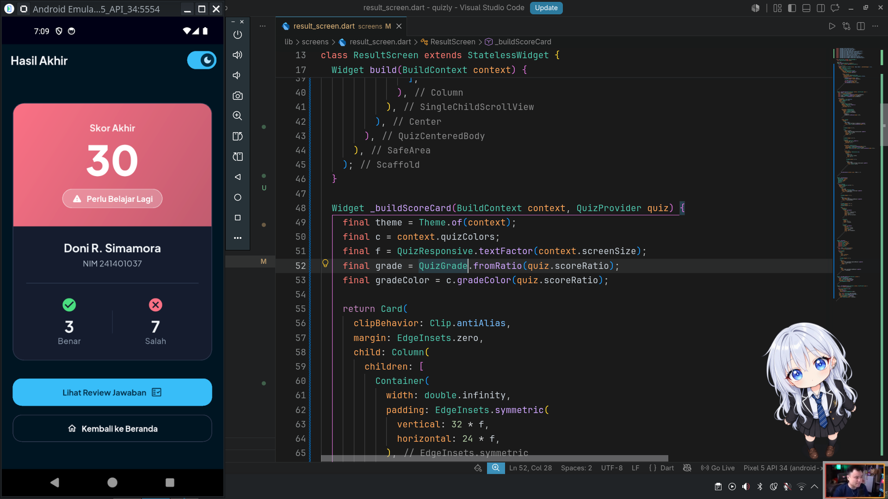
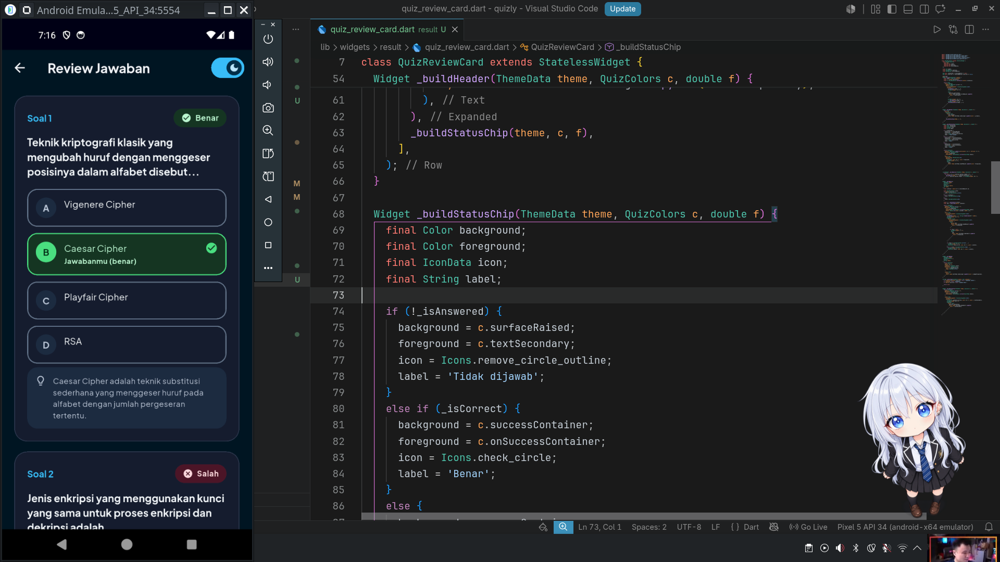

# Quizly

Quizly adalah aplikasi kuis pilihan ganda bertema kriptografi berbasis Flutter. Pengguna memasukkan nama, menjawab serangkaian pertanyaan, lalu melihat skor akhir atas namanya beserta ulasan jawaban. Proyek ini dikerjakan secara individu sebagai tugas Take-Home UTS Pemrograman Mobile, Semester Ganjil T.A. 2026/2027.

## Daftar Isi

- [Identitas Mahasiswa](#identitas-mahasiswa)
- [Tentang Aplikasi](#tentang-aplikasi)
- [Fitur](#fitur)
- [Pemenuhan Kriteria Tugas](#pemenuhan-kriteria-tugas)
- [Teknologi dan Dependencies](#teknologi-dan-dependencies)
- [Struktur Proyek](#struktur-proyek)
- [Alur Aplikasi](#alur-aplikasi)
- [Cara Menjalankan](#cara-menjalankan)
- [Catatan Lingkungan Pengembangan](#catatan-lingkungan-pengembangan)
- [Dokumentasi](#dokumentasi)
- [Credit Aset](#credit-aset)
- [Riwayat Commit](#riwayat-commit)
- [Progres Pengerjaan](#progres-pengerjaan)

---

## Identitas Mahasiswa

| | |
| :--- | :--- |
| Nama | Doni Rivaldo Simamora |
| NIM | 241401037 |
| Lab | PM 1 |

Program Studi Ilmu Komputer, Fakultas Ilmu Komputer dan Teknologi Informasi, Universitas Sumatera Utara.

---

## Tentang Aplikasi

- **Nama aplikasi:** Quizly
- **Deskripsi singkat:** aplikasi kuis pilihan ganda bertema kriptografi di mana pengguna mengisi nama, menjawab pertanyaan satu per satu, lalu melihat skor akhir dan review jawabannya.

Kuis terdiri dari 10 pertanyaan seputar dasar-dasar kriptografi, seperti cipher klasik, enkripsi simetris dan asimetris, fungsi hash, dan tanda tangan digital. Seluruh data pertanyaan bersifat lokal (dummy), jadi aplikasi berjalan tanpa database dan tanpa koneksi internet. Semua pertanyaan disimpan di satu sumber data dan ditampilkan oleh satu halaman kuis yang dinamis. State management memakai `provider` supaya progres jawaban tidak hilang saat layar dirotasi atau pengguna berpindah halaman. Navigasi memakai `go_router`.

---

## Fitur

- Input nama pengguna dengan validasi.
- Kuis pilihan ganda, satu pertanyaan per layar, dengan indikator nomor soal dan progres.
- Progres jawaban tetap tersimpan saat layar dirotasi atau berpindah halaman.
- Skor akhir atas nama pengguna, lengkap dengan jumlah jawaban benar dan salah.
- Review jawaban: jawaban pengguna, jawaban yang benar, dan status benar/salah tiap soal.
- Ukuran elemen UI dinamis mengikuti ukuran layar, tanpa nilai hardcode.

### Fitur tambahan dan bonus

- [ ] Dual-theme (dark dan light mode)
- [ ] Adaptive dan responsive layout untuk tablet dan web
- [ ] Native splash screen kustom yang menyesuaikan tema terang/gelap (menghindari blank screen di awal)

---

## Pemenuhan Kriteria Tugas

| No | Kriteria wajib | Implementasi | Selesai |
| :-: | :--- | :--- | :-: |
| 1 | `StatelessWidget` dan `StatefulWidget` | `StatefulWidget` dipakai pada form input nama untuk mengelola `TextEditingController`, `StatelessWidget` untuk komponen UI statis seperti tombol dan kartu. | [ ] |
| 2 | Minimal 2 halaman dan navigasi | 4 halaman (Home, Quiz, Result, Review) dengan `go_router` | [x] |
| 3 | Reusable widget di file terpisah | `lib/widgets/` | [ ] |
| 4 | Aset gambar atau ikon | `assets/images/` | [x] |
| 5 | Font kustom | Plus Jakarta Sans, diatur terpusat lewat `ThemeData`. | [x] |
| 6 | Ukuran UI dinamis | `QuizResponsive.appBuilder` dan `MediaQuery.sizeOf(context)` untuk menghitung padding dan skala teks (`TextScaler`). | [x] |
| 7 | State management (progres aman saat rotasi dan pindah halaman) | `provider` (`ChangeNotifier`) | [ ] |
| 8 | Tanpa database | Data lokal di `lib/data/` | [x] |
| 9 | GitHub sebagai pelacak progres | Commit bertahap per fitur | [x] |

| Bonus | Selesai |
| :--- | :-: |
| Dual-theme (dark dan light mode) | [x] |
| Adaptive dan responsive design (tablet / web) | [x] |

---

## Teknologi dan Dependencies

| Package | Kegunaan |
| :--- | :--- |
| `flutter` | SDK utama |
| `go_router` `^18.0.2` | Navigasi antar halaman |
| `provider` `^6.1.5+1` | State management (`ChangeNotifier`) untuk progres kuis |
| `cupertino_icons` `^1.0.8` | Ikon bergaya iOS |
| `flutter_lints` `^6.0.0` | Aturan linting |
| `flutter_native_splash` `^2.4.1` | Membuat native splash screen sesuai tema |
| `flutter_launcher_icons` `^0.13.1` | Mengganti ikon aplikasi (launcher icon) bawaan menjadi ikon kustom |

Aset yang dideklarasikan di `pubspec.yaml`:

- Gambar: `assets/images/`
- Font kustom: Plus Jakarta Sans (Regular 400, Medium 500, Bold 700, ExtraBold 800)

---

## Struktur Proyek

```text
quizly/
├── assets/
│   ├── fonts/                  # Font kustom
│   └── images/                 # Gambar dan ilustrasi
├── lib/
│   ├── app/
│   │   ├── quizly_app.dart     # MaterialApp.router
│   │   ├── quizly_routes.dart  # Konfigurasi rute go_router
│   │   └── theme/              # Warna, tipografi, light dan dark theme
│   ├── models/                 # Model data (question.dart, dll.)
│   ├── data/                   # Data pertanyaan lokal
│   ├── providers/              # State management (quiz_provider.dart)
│   ├── screens/
│   │   ├── home/               # Input nama
│   │   ├── quiz/               # Halaman pertanyaan
│   │   ├── result/             # Skor akhir
│   │   └── review/             # Review jawaban
│   ├── widgets/                # Reusable widget
│   │   ├── common/
│   │   ├── home/
│   │   ├── quiz/
│   │   └── result/
│   ├── utils/                  # Helper dan konstanta (ukuran responsif, dll.)
│   └── main.dart
├── screenshots/                # Tangkapan layar untuk dokumentasi
├── pubspec.yaml
└── README.md
```

---

## Alur Aplikasi

```text
Home  ->  Quiz  ->  Result  ->  Review
```

1. Di halaman Home, pengguna memasukkan nama lalu menekan tombol mulai.
2. Di halaman Quiz, pengguna menjawab pertanyaan satu per satu. Jawaban disimpan di `QuizProvider`.
3. Setelah pertanyaan terakhir, halaman Result menampilkan nama dan skor akhir.
4. Dari halaman Result, pengguna bisa membuka halaman Review untuk melihat jawaban yang benar dan salah.

---

## Cara Menjalankan

Prasyarat:

- Flutter SDK dengan Dart yang kompatibel dengan `^3.12.2` (lihat `environment` di `pubspec.yaml`)
- Emulator Android/iOS, perangkat fisik dengan USB debugging aktif, atau browser Chrome

Langkah:

```bash
flutter pub get
flutter run
```

Untuk menjalankan di browser:

```bash
flutter run -d chrome
```

Opsional, cek kualitas kode:

```bash
flutter analyze
```

---

## Catatan Lingkungan Pengembangan

Aplikasi ini saya kembangkan dan uji di **Arch Linux**, sedangkan perangkat penilai kemungkinan memakai **Windows**. Walaupun Flutter bersifat cross-platform, perbedaan lingkungan kadang menimbulkan error yang tidak muncul di mesin saya. Berikut lingkungan pengembangan saya dan hal-hal yang perlu dicek bila terjadi error saat dijalankan di Windows.

Lingkungan pengembangan:

| | |
| :--- | :--- |
| OS | Arch Linux |
| Flutter | 3.44.9 (channel stable) |
| Dart | 3.12.2 |
| Perangkat uji | Pixel_5_API_34 (Emulator Android dan Chrome) |

Kemungkinan penyebab error di Windows dan solusinya:

1. **Versi SDK tidak cocok.** Proyek ini membutuhkan Dart `^3.12.2`. Jika `flutter pub get` gagal dengan pesan soal versi SDK, jalankan `flutter upgrade` atau pakai versi Flutter yang sama dengan tabel di atas.
2. **Developer Mode belum aktif.** Windows membutuhkan Developer Mode untuk symlink saat `flutter pub get`. Aktifkan lewat `start ms-settings:developers`.
3. **Cache build bawaan.** Jalankan `flutter clean`, lalu `flutter pub get`, lalu `flutter run`.
4. **Toolchain belum lengkap.** Jalankan `flutter doctor` dan pastikan tidak ada tanda silang pada Android toolchain atau Chrome.
5. **Perbedaan line ending (LF/CRLF).** Peringatan dari Git soal line ending tidak memengaruhi build dan bisa diabaikan.

Jika setelah langkah di atas aplikasi masih tidak bisa berjalan, mohon lihat video presentasi pada bagian Dokumentasi sebagai bukti bahwa aplikasi berjalan di lingkungan saya, atau hubungi saya agar bisa saya bantu cek langsung.

---

## Dokumentasi

### Screenshot

| Halaman | Tampilan |
| :--- | :---: |
| Home |  |
| Quiz |  |
| Result |  |
| Review |  |

### Video Presentasi

TODO: tempel link Google Drive (durasi maksimal 10 menit).

---

## Credit Aset

| Aset | Sumber | Pembuat / Lisensi |
| :--- | :--- | :--- |
| Font Plus Jakarta Sans (Regular 400, Medium 500, Bold 700, ExtraBold 800) | [Google Fonts](https://fonts.google.com/specimen/Plus+Jakarta+Sans) | Tokotype, SIL Open Font License 1.1 |
| Material Icons | [Google Fonts Icons](https://fonts.google.com/icons) | Apache License 2.0 |

---

## Riwayat Commit

Proyek dikerjakan bertahap dengan satu commit untuk tiap fitur yang selesai. Riwayat lengkap ada di tab [Commits](../../commits) repository ini. Format pesan commit yang saya pakai mengikuti pola `tipe(lingkup): deskripsi`, misalnya:

- `chore: initial project setup`
- `feat(router): integrate go_router navigation`
- `feat(ui): add home screen with name input`
- `feat(quiz): add quiz screen and question data`
- `feat(state): implement QuizProvider for answer progress`
- `feat(result): add result and review screen`
- `style(theme): apply custom font and app theme`
- `fix(ui): resolve overflow on small screens`
- `docs: update README`

---

## Progres Pengerjaan

- [x] Tahap 1: Inisialisasi proyek dan konfigurasi dependencies dan aset
- [x] Tahap 2: Struktur folder, tema, dan font kustom
- [x] Tahap 3: Model dan data pertanyaan lokal
- [ ] Tahap 4: Navigasi dengan `go_router`
- [ ] Tahap 5: Halaman Home dan reusable widget
- [ ] Tahap 6: Halaman Quiz dan state management dengan `provider`
- [ ] Tahap 7: Halaman Result dan Review
- [ ] Tahap 8: Responsivitas, uji rotasi layar, dan perbaikan overflow
- [ ] Tahap 9 (bonus): Dual-theme dan adaptive layout tablet/web
- [ ] Tahap 10: Screenshot, video presentasi, dan finalisasi README

---

Dibuat untuk memenuhi tugas UTS Pemrograman Mobile, Unit IKLC Program Studi Ilmu Komputer, Universitas Sumatera Utara.